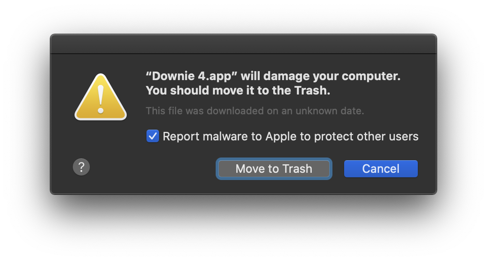

On Tuesday, August 4th, Apple published a global kill signal to the certificate system that allows [Charlie Monroe's applications](https://twitter.com/charlieMonroe/status/1290509083288764428) to run on macOS. These apps are part of the [Gatekeeper program](https://developer.apple.com/developer-id/) that lets a registered Apple developer distribute their software outside the Mac App Store. Without a Gatekeeper signature, macOS makes it somewhat difficult for a user to launch a non-signed app and is not considered a sustainable way to distribute commercial software.

However, if the kill signal has been sent out by Apple, the signed apps can never be launched again. Instead users are presented with an alert like the following:

There is a good collection of reactions to this event on [Michael Tsai's Blog](https://mjtsai.com/blog/2020/08/04/apple-remote-kills-long-time-developers-apps/).

Apple did restore Charlie's certificates. You can read more about it from his own blog: [A Day Without Business](https://blog.charliemonroe.net/a-day-without-business/)

Catching up on the matter myself, I can't help but think not only should Apple turn off its automated execution of such bans but they should also move to a more nuclear-launch type system where at least two people need to turn their key.

Additionally, if Gatekeeper is truly about protecting the users, I don't see why we can't have a transparency report listing the identifiers that have been disabled and why. A lot of [people keep saying Apple does not abuse this power](https://overcast.fm/+KxFFOGVu8/31:37), but there is no proof to this; it is a closed system. We only know of Charlie's situation because he posted it on Twitter. Considering it wasn't too long ago when the App Store Guidelines down right [threatened you about going public](https://twitter.com/benthompson/status/1275072296001007617) I don't know if we can give Apple the benefit of the doubt here.

I know many look to Gatekeeper as a saving grace, a last ray of hope that the Mac will somehow remain the open computer platform they originally fell in love with. They hope Gatekeeper will help avoid a App Store-only future. I hope so too.

Adding a formal, descriptive transparency report would restore a lot of faith in the Gatekeeper system after this week's events.
